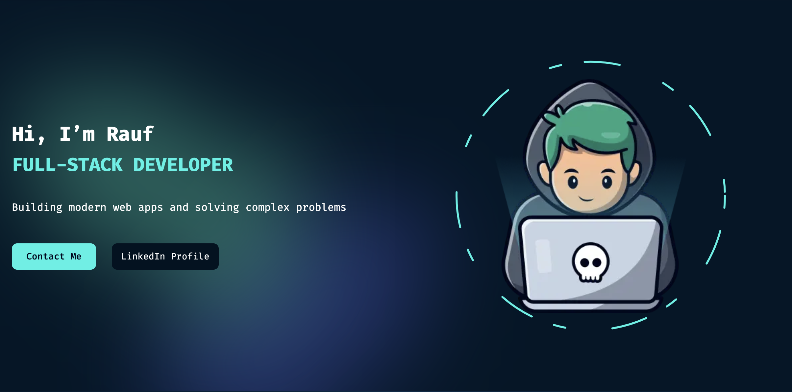

# Personal Portfolio Website
[](#)
[](#)
[](https://github.com/Ph4ntomByte/profile/commits)
[](https://github.com/Ph4ntomByte/profile)  
[](https://github.com/Ph4ntomByte/profile/blob/main/LICENSE)

---

## 🚀 Features

- **Hero Banner** with animated role-switcher and rotating elements
- **Projects Gallery**: Dynamic project cards with filters and live links
- **Skills Showcase**: Icon-based skill list with proficiency indicators
- **Dark/Light Theme** toggle and **Language Switcher**
- **Responsive Design**: Mobile-first, works on all screen sizes
- **SEO Optimized**: Metadata, sitemap, robots.txt configured

---

## 🛠️ Tech Stack

- **Framework**: Next.js (App Router)
- **Styling**: Tailwind CSS
- **Font**: Next/font (Geist Sans & Mono, Fira Code)
- **Components**: React, shadcn/ui, lucide-react
- **State & Animations**: Custom hooks, Framer Motion
- **Data**: Static JSON for projects, services, skills, themes
- **Deployment**: GitHub Pages / Vercel

---

## 📥 Installation & Local Development

1. **Clone** the repository:
   ```bash
   git clone https://github.com/Ph4ntomByte/Ph4ntomByte.github.io.git
   cd Ph4ntomByte.github.io
   ```

2. **Install** dependencies:
   ```bash
   npm install
   ```

3. **Run** in development mode:
   ```bash
   npm run dev
   ```
   Open [http://localhost:3000](http://localhost:3000) to view locally.

4. **Build** for production:
   ```bash
   npm run build
   npm run start
   ```

---

## 🧩 Customization

- **Add Projects**: Edit `src/appData/projects.ts` and re-run.
- **Change Theme Colors**: Modify `utils/themes.ts` or Tailwind config.
- **Update Content**: All text lives in JSON under `appData/`.
- **Add New Sections**: Create a new component under `src/components` and import in `src/app/page.tsx`.

---

## 📫 Contact & Feedback

- **Email**: support@studentlifeishell.me
- **LinkedIn**: https://www.linkedin.com/in/rauf-suleymanov-73409a296/
- **GitHub**: https://github.com/Ph4ntomByte  